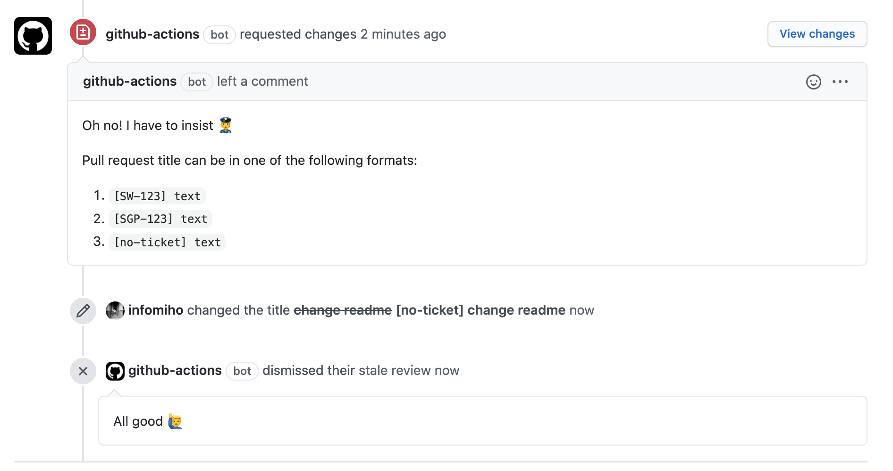

# PR Name Check Action

### What does it do



This action validates pull request titles. For example, it validates with the following formats:

```
[SW-123] text
[SGP-123] text
[no-ticket] text
```

The prefixes `SW` and `SGP` are configurable. Also the `no-ticket` string. If the pull request title doesn't satisfy the format,
this action will notify you.

### How it notifies you

Github Bot will request changes with a comment. When the title is corrected it will let the merge request pass.

### How to use it

Example workflow file you should create in `.github/workflows/pr-name-check.yml` in your project. Adjust it to your needs.

```yaml
name: PR Name Check

on:
  pull_request:
    types: [opened, edited, reopened]

jobs:
  pr-lint:
    runs-on: ubuntu-latest
    steps:
      - uses: superbet-group/pr-name-check-action@main
        with:
          title-projects: SW|SGP
          title-fallback: no-ticket
          on-failed-regex-comment:
            "Oh no! I have to insist 👮\n\nPull request title can be in one of the following formats:\n%formats%"
          on-title-corrected-comment:
            "All good 🙋‍♂"
          repo-token: "${{ secrets.GITHUB_TOKEN }}"
```

Forked from https://github.com/MorrisonCole/pr-lint-action